# Ansible Linux Baseline Configuration

## Overview

This project demonstrates the use of Ansible to automate baseline configuration and hardening of multiple Rocky Linux servers.

The environment consists of one Ansible control node managing two Rocky Linux servers. The playbook automates common Linux administration tasks including user provisioning, package installation, SSH hardening, firewall configuration, web server deployment, and custom system banner configuration.

The goal of this project was to gain hands-on experience with Ansible automation while applying Linux administration concepts commonly found in enterprise environments.

---

## Skills Demonstrated

- Ansible Automation
- Linux Administration
- Rocky Linux
- Configuration Management
- Infrastructure as Code (IaC)
- Multi-Node Management
- SSH Hardening
- Firewalld Administration
- Nginx Deployment
- Jinja2 Templates
- User and Group Management
- Service Management
- System Hardening
- Idempotent Automation
- Troubleshooting and Verification

---

## Environment

| Component | Details |
|------------|----------|
| Control Node | Rocky Linux |
| Managed Nodes | Server1, Server2 |
| Automation Tool | Ansible |
| Web Server | Nginx |
| Firewall | Firewalld |
| Template Engine | Jinja2 |

---

## Project Structure

```text
ansible-linux-baseline/
├── ansible.cfg
├── inventory
├── site.yml
├── group_vars/
│   └── all.yml
├── playbooks/
│   ├── users.yml
│   ├── packages.yml
│   ├── ssh.yml
│   ├── firewall.yml
│   ├── nginx.yml
│   └── motd.yml
└── templates/
    └── motd.j2
```

---

## Configuration Tasks

### User Management

Created a centralized administrative account across all managed nodes.

Tasks performed:

- Created `sysadmin` user
- Added user to the `wheel` group
- Configured login shell
- Created user home directory

Screenshot:

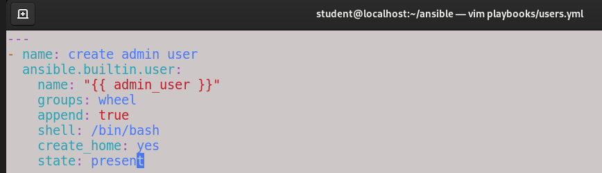

---

### Package Installation

Installed common administration and infrastructure packages across all managed nodes.

Packages included:

- vim
- wget
- curl
- git
- nginx
- firewalld

Screenshot:

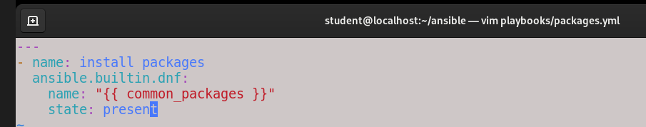

---

### SSH Hardening

Configured OpenSSH security settings to improve remote administration security.

Changes included:

- Disabled direct root login
- Configured SSH idle timeout
- Configured ClientAliveCountMax
- Restarted SSH service

Screenshot:

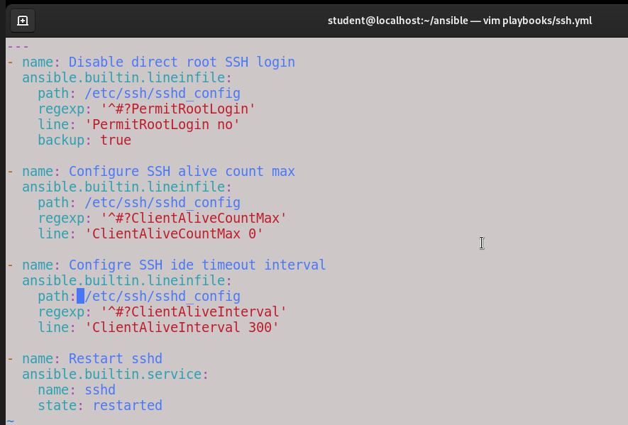

---

### Firewall Configuration

Configured Firewalld to allow required services.

Services enabled:

- SSH
- HTTP

Screenshot:

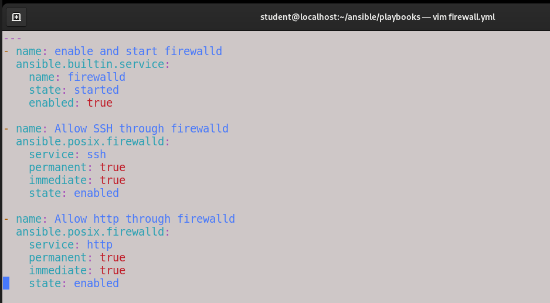

---

### Nginx Deployment

Installed and configured the Nginx web server.

Tasks performed:

- Enabled Nginx service
- Started Nginx service
- Deployed custom web page

Screenshot:

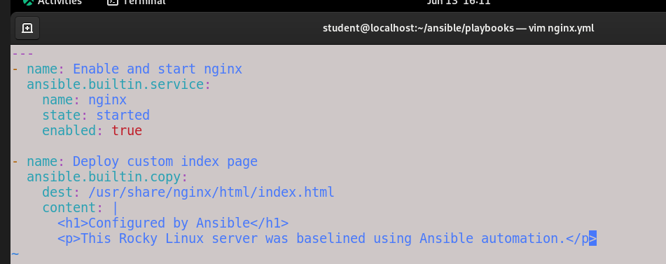

---

### Dynamic MOTD Deployment

Created a dynamic Message of the Day using Jinja2 templates and Ansible Facts.

Information displayed:

- Hostname
- IP Address
- Administrative banner

Template Screenshot:

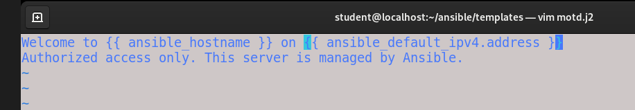

Playbook Screenshot:

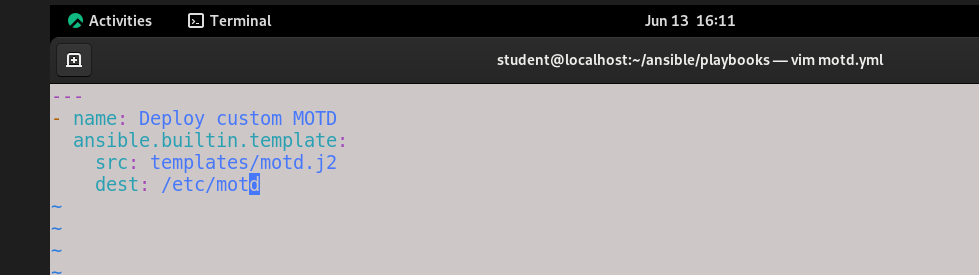

---

## Main Playbook

The project uses a centralized playbook to orchestrate all configuration tasks.

Screenshot:

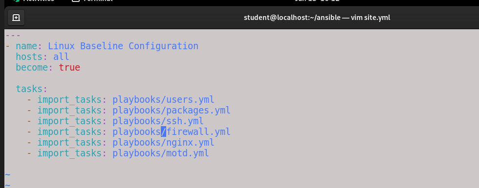

---

## Ansible Configuration

### Ansible Configuration File

Configured Ansible defaults including inventory and privilege escalation settings.

Screenshot:

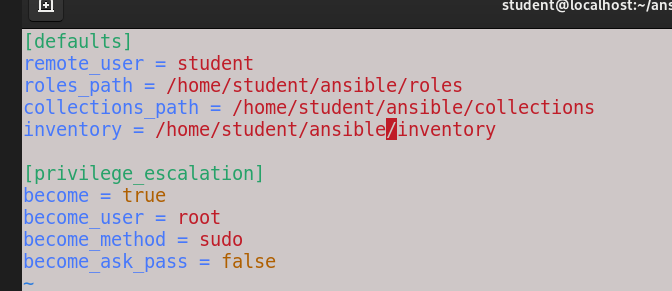

---

### Inventory

Defined managed hosts for automation.

Screenshot:

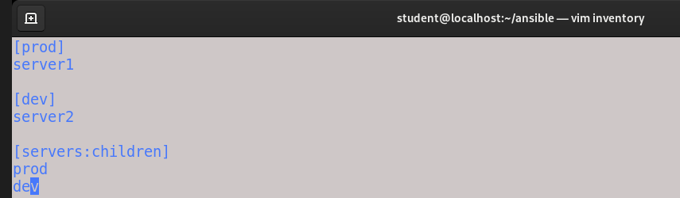

---

### Variables

Used group variables to centralize reusable configuration values.

Screenshot:

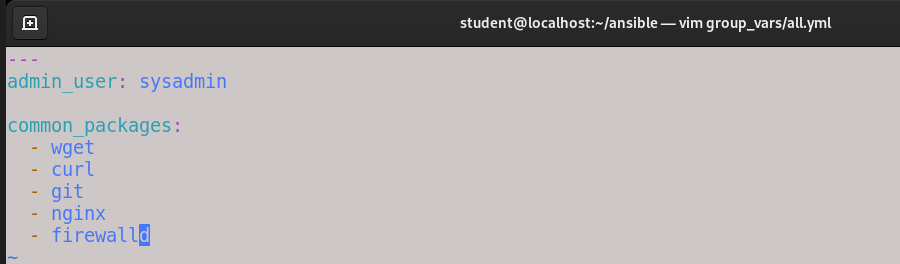

---

## Playbook Execution

Successfully executed the playbook against both managed nodes.

Results:

- Server1 configured successfully
- Server2 configured successfully
- No failures encountered

Screenshot:

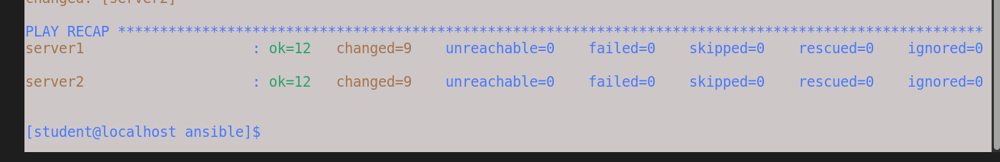

---

## Verification

### User Verification

Verified that the administrative account was created on all managed nodes.

Screenshot:

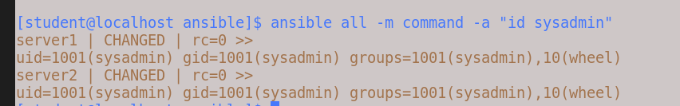

---

### SSH Verification

Verified SSH hardening settings.

Confirmed:

- PermitRootLogin disabled
- ClientAliveInterval configured
- ClientAliveCountMax configured

Screenshot:

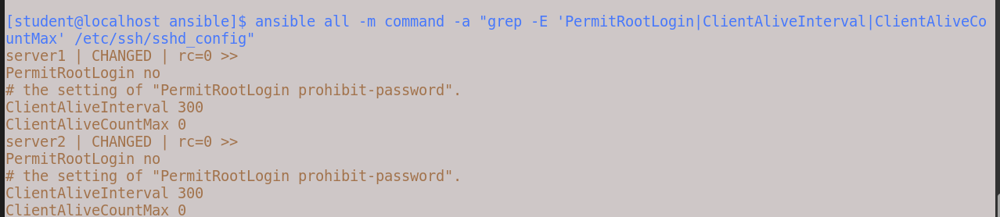

---

### Firewall Verification

Verified Firewalld configuration.

Confirmed:

- SSH service allowed
- HTTP service allowed

Screenshot:

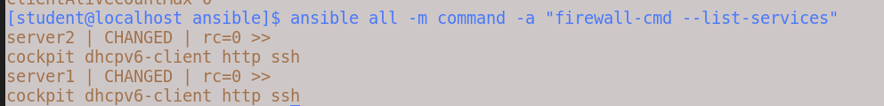

---

### Nginx Verification

Verified that Nginx was active on all managed nodes.

Screenshot:

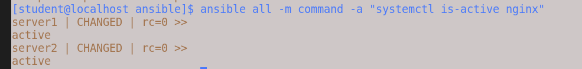

---

### MOTD Verification

Verified successful deployment of the dynamic MOTD banner.

Screenshot:

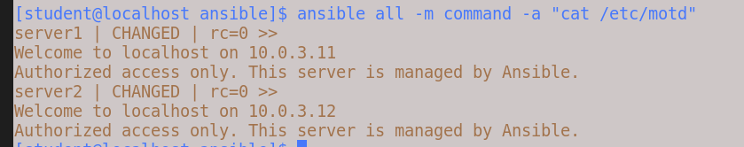

---

## Idempotency Verification

Ansible playbooks should be safe to execute repeatedly without causing unwanted changes.

The playbook was executed multiple times to verify idempotent behavior.

Screenshot:

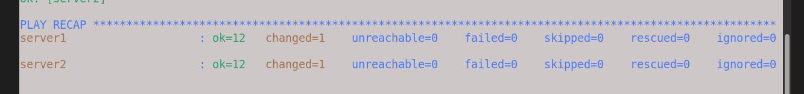

---

## Lessons Learned

Through this project I gained practical experience with:

- Building and managing Ansible inventories
- Structuring multi-playbook Ansible projects
- Managing Linux users and groups through automation
- Deploying services across multiple systems
- Hardening SSH configurations
- Managing Firewalld using Ansible
- Deploying dynamic content with Jinja2 templates
- Verifying automation results across multiple hosts
- Troubleshooting Ansible playbooks and Linux services
- Applying Infrastructure as Code principles to Linux administration

---

## Future Improvements

Potential enhancements include:

- Converting playbooks into reusable Ansible Roles
- Implementing Ansible Handlers
- Managing SELinux policies through Ansible
- Deploying Docker containers through automation
- Integrating Ansible Vault for secret management
- Expanding web server configuration and SSL deployment
